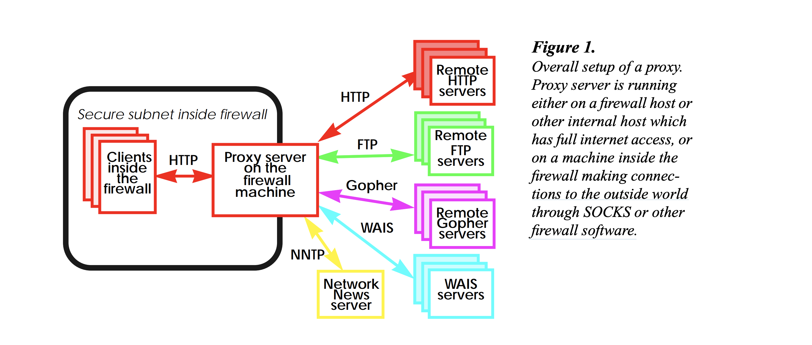

# 代理服务

### 什么是代理服务


主要使用代理的地方是在防火墙内部允许访问web。代理是一个特殊的**HTTP服务**，典型的运行在一个防火墙机器。代理接受从防火墙内的请求，并转发请求到防火墙外部的远程服务，读取响应，并把响应发送回客户端。如下图，所示。

防火墙内部的所有客户端都使用相同的代理，代理可以缓存多个客户端请求的文档数据，进而降低网络流量。

代理服务器在请求服务时代表客户端运行，从而可能掩盖了对资源服务器的请求的真正来源.


### 代理服务的分类

传递未经修改的请求和响应的代理服务器通常称为网关，有时也称为隧道代理。

前向代理是面向Internet的代理，用于从各种来源检索数据，更加临近客户端。

反向代理通常是面向内部的代理，用作前端以控制和保护对专用网络上服务器的访问。反向代理（或代理）是代理服务器，在客户端看来，这是一台普通服务器。反向代理将请求转发到处理该请求的一台或多台普通服务器。来自代理服务器的响应就像直接来自原始服务器一样返回，使客户端不了解原始服务器。

和正向代理不同，反向代理更加临近web服务器，仅服务于一组服务器。

反向代理的作用：

* 加密SSL加速
* 负载均衡
* 缓存静态内容
* 压缩内容

